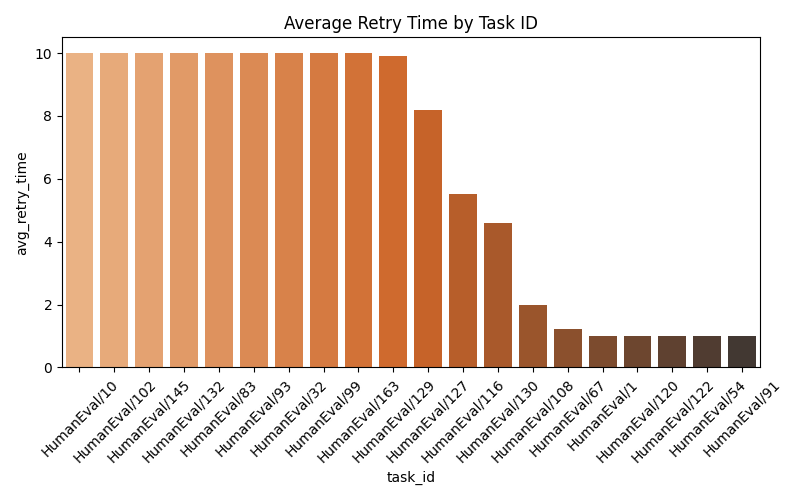

# 实验结果&结论

<!--1.数据对应的问题-->
<!--2.数据-->
<!--3.问题对应的目的-->

## 1数据集分析
### 1.1数据集的可读性：
**1.1.1对齐前的可读性**

**数据对应的问题**：对齐前的数据集是否可读性较差

**问题对应的目的**：证明原始数据集的缺陷：包含可读性较差、注释有误等（可以举具体的case放附录里）

路径：.{数据集名称}_read_abality.json

**注意**：这里的可读性是精确到每个case的精确值。如果要看均值，可以移步2.2章节

json文件解释：
```python
[
    # 指标名
    "flesch_reading_ease": [
        # 每一个case的可读性指标得分
        74.69,
        61.33,
        69.79,
        66.67,
        43.39,
        ...]
]
```
**1.1.2对齐后的可读性**

**数据对应的问题**：对齐后的数据集是否可读性有上升？

**问题对应的目的**：证明我们数据集制作过程中对齐这一步是必要的。

路径：.{数据集名称}_aligned_read_abality.json

### 1.2数据集的长度分析
**1.2.1对齐前的长度**

**数据对应的问题**：对齐前的数据集是否注释过于冗余？导致信息密度降低？

**问题对应的目的**：证明原始数据集的长度普遍较长、信息密度普遍偏低。

路径：.{数据集名称}_original_length.json

文件是一个列表，里面是每个case的注释长度

整体的结果：
- pandasEval：
  - 总长度：13804
  - 平均长度：
- numpyEval：
  - 总长度：13444
  - 平均长度：
- classEval: 
  - 总长度：53461
  - 平均长度
- humanEval: 
  - 总长度：
  - 平均长度：36231

CodeSearchNet:
训练集：
- 总长度：119020886
- 平均长度：288.76088971269695
验证集：
- 总长度：7555789
- 平均长度：326.9913446141862
测试集：
- 总长度：6663684
- 平均长度：300.49080086580085

**1.2.2对齐后的长度**

**数据对应的问题**：对齐后的数据集是否信息密度有所上升？

**问题对应的目的**：证明我们数据集制作过程中对齐这一步是必要的。

路径：.{数据集名称}_aligned_length.json

整体结果：

numpyEval：
- 总长度：11090
- 减少的长度：2354
- 平均每个case减少的字符数：23.306930693069308

pandasEval：
- 总长度：11789
- 减少的长度：2015
- 平均每个case减少的字符数：19.95049504950495

classEval:
- 总长度:53554
- 减少的长度：-93(一定程度上能说明classEval的注释效果明显优质，classEval也比较新，也能说明我们对齐这个步骤的正确性)
- 平均每个case减少的字符数：-0.93

humanEval:
- 总长度：30904
- 减少的长度：5327
- 平均每个case减少的字符数：


**1.2.3对齐前后的长度方差（熵）**

**数据对应的问题**：对齐前原始数据集是否注释长度熵较大？对齐后这一现象是否得到了改善？

**问题对应的目的**：证明我们数据集制作过程中对齐这一步是必要的。

Before/After：对齐前后

熵、方差、标准差

pandasEval:
- Before: 5.335817813681178 (8541.21007744339, 92.41866736457192)
- After: 4.941006096007957 (5417.269679443194, 73.60210377049826)

numpyEval:
- Before: 5.226633285703219 (8381.542593863347, 91.55076511894015)
- After: 4.955769381904778 (5391.168708950104, 73.42457837093859)

classEval:
- Before: 6.518601124309857 (51232.277899999994, 226.34548349812505)
- After: 6.491587981778348 (47761.62839999998, 218.5443396658902)

humanEval:
- Before:5.885502424045776 (29339.426643367045, 171.28755542469233)
- After: 5.733674567323545 (14126.892623438429, 118.85660529999345)

CodeSearchNet
- Train: 6.2295117460186225 (292645.98909268936, 540.9676414469625)
- Val: 6.169694288662192 (332333.53590985085, 576.4837689908111)
- Test: 6.012762036275767 (348103.5250777136, 590.0029873464316)

说明的问题：
- 复杂任务的注释长度方差明显会大（反映在ClassEval >> humanEval >> Pandas/NumpyEval
- 对齐操作一定程度上可以减小注释的风格差异（不同数据集对齐后长度方差都会明显下降）

### 1.3 可读性
codeSearchNet：
- 详细的、每条case的可读性：
  - detailed_test_aligned_read_ability.json
  - detailed_train_aligned_read_ability.json
  - detailed_validation_aligned_read_ability.json
- 平均的可读性：
  - test_aligned_read_ability.json
  - train_aligned_read_ability.json
  - validation_aligned_read_ability.json

其他四个详细的、每条case的可读性：
- {数据集名称}_aligned_read_ability.json

### 1.4 待做
- HumanEval和ClassEval的结果当时没存，跑代码存一下
  - 长度分析 (√)
  - 对齐(√)
  - 可读性(√)
- 对CodeSearchNet数据集也做一套相同的流程分析(√)


## 2注释
### 2.1 模型&数据集介绍
**2.1.1 我们做的数据集包含**

**数据对应的问题**：如何选择数据作为我们数据集的原始数据？选择哪些大模型进行实验？

**问题对应的目的**：证明我们数据集的数据选取是合理的。证明我们的模型选取是合理的。

- 选用的模型：
  - Mistral 7B
  - Gpt3.5
  - Gpt4
  - Deepseek coder v2
- 数据集
  - HumanEval
  - NumpyEval
  - PandasEval
  - ClassEval

**2.1.2** 要跑过baseline的数据集
- CodeSearchNet

### 2.2 可读性分析

**数据对应的问题**：不同LLM生成的注释可读性与对齐后的数据相比，可读性如何？

**问题对应的目的**：验证不同LLM生成注释的效果（从可读性角度评估）

这里指的是不同模型在不同数据集上生成注释的可读性

**注意**：model为Dataset的时候，这个指标指的是原始数据集的注释的可读性（跟模型没关系）

路径：/results/readAbality/{指标名}.json

json文件解释：
 ```python
# Demo
[
    {
        "model": "deepseek_v2", # 生成注释的模型

        "dataset": "pandasEval", # 数据集名称
            
        "gunning_fog": 9.311980198019798 # 指标值
    }
    ...
]
 ```
### 2.3 数据集效果验证

**数据对应的问题**：不同LLM生成的注释是否贴合原始注释？使用三种指标评估。

**问题对应的目的**：验证不同LLM生成注释的效果（从综合评分角度评估）

Meeting明确的一点：我们要在我们的数据集上微调，实验我们的方法，然后迁移到CodeSearchNet上，证明我们的方法是有效的。

文件目录：
./results/evaluation/{模型名称}/{数据集名称}/{评价指标}.json
- 模型名称就是上面那四个
- 评价指标包含：
  - smoothed-bleu4
  - rouge
  - bert-score
- 数据集包含
  - pandaseval
  - numpyeval
  - classeval
  - humaneval

### 2.4 不同LLM生成结果的test_case分支覆盖率分析

**数据对应的问题**：不同LLM生成test_case的能力如何？是否有未完全覆盖或冗余现象？

**问题对应的目的**：验证不同LLM生成注释的效果

原始数据集中（classEval，humaneval）代码的分支数：
- results\testcases\classeval_branch.json
- results\testcases\humaneval_branch.json

不同大模型生成的test_case覆盖的分支数：
- results\testcases\cover\

classEval上各个大模型的test_case的分支覆盖率表现：
- gpt_4 0.6533180778032036
- deepseek_v2 0.7634285714285715
- gpt_3_5 0.2845714285714286
- mistral 0.3314285714285714

humanEval上各个大模型的test_case的分支覆盖率的表现：
- gpt_4 0.8997772828507795
- deepseek_v2 0.9487750556792873
- gpt_3_5 0.7149220489977728
- mistral 0.7527839643652561

### 2.4 具体的一些case/实验结果
**2.4.1 每个模型+数据集的结果**

**数据对应的问题**：具体展示每个LLM生成的注释的case，可以观察分析得到一些结论

**问题对应的目的**：验证不同LLM生成注释的效果

路径：./results/{模型名}/{数据集名称}/

**2.4.2 每个数据集对齐后的case**

**数据对应的问题**：具体展示对齐后的数据集，可以观察分析得到一些结论

**问题对应的目的**：证明我们数据集制作过程中对齐这一步是必要的。

路径：./prompt/aligned/{数据集名称}/

**2.4.3 prompt**

**数据对应的问题**：具体展示我们的prompt

**问题对应的目的**：证明我们的prompt设置是合理的。

路径：
- 对齐的prompt
  - ./prompt/test_prompts/alignment.txt
- 跑结果的prompt
  - ./prompt/test_prompts/comment.txt

## 2.5 一些图片

当时为了方便看效果临时画的

**2.5.1 可读性图**

路径：./figures/imgs/readability

**2.5.2 BertScore评分**

路径：./figures/imgs/bert_score.png

**2.5.3 长度比**

路径：./figures/imgs/CompressionRadio_bar.png

**2.5.4 rouge_s评分**

路径：./figures/imgs/rouge_s_score.png

## 2.6 待做

 - HumanEval与classEval的实验补上
 - 用微调的Deepseek和GPT做一下，得干过Baseline(codeT5+, Incoder)[!]
 - 各个实验集中在CodeSearchNet数据集上再做一下
 - Deepseek coder v2 7b/8b 再跑一遍
 - T5 用我们的方法做一下，看看能不能跑得过

## 3 代码生成
======================================================

### desicion-making mechanism

注释到代码时，考虑注释的关键信息，进行一定的筛选，而不是利用注释的全部信息。

注释选择问题

有些情况下，注释未必有效，甚至是负效应，然后反过来，对于无效或者负效应的注释，我们应该filter掉。或者说，至少不应该影响整体的代码质量。

需要一个**判别器，提高参与代码生成的注释的质量。**

注释part1对应代码code1

注释part2对应代码code2

结合出错信息，把无效或负效应的注释，在迭代过程中，给逐步消解掉。

如果做，在生成代码前，就决定注释效用，很难。

但是如果代码出错了，那我们反过来推测注释有问题，这个还是比较好做的。

**迭代**

还可以继续提高模型的代码生成能力

1. 不动注释的retry迭代
2. 不断分析并修正出错部分的注释的retry迭代

insight：如何更好地利用注释去迭代？

======================================================

### next trajectory prediction

注释代码或者代码生成时，使用memory模块，记录正确代码生成的trajectory

insight：假定模型生成简单的代码的trajectory有效，则其应当可以辅助模型生成更难的代码。

第一遍实验，humaneval，90分，有很多对了的case，我们可以让高级或同等级模型记录或summary这个信息

然后在做不对的10%，检索最相关的一些信息，辅助模型做代码生成。

以小博大，用简单的辅助提高困难的代码生成能力。

insight：

模型生成代码的trajectory应该可以复现，并不断被使用，同时提高代码生成能力。

RAG

最好的路子，是训练到模型内部（if）（复现o1）self-play，让模型学会了如何去思考，然后对一个问题，如果模型预测了多个路径，则进行一个搜索树的决策过程，类似于AlphaGo

如果不好做，则直接用rag，表示这条路走得通，而且也是一个insight（成本低，且简单）

**数据泄露？**

### reward model（砍了）

这个可选

先训练一个注释到代码的reward model，然后用reward model评估LLM代码生成的质量

**高质量的注释数据集**

注释符合人为分布，以及对整体任务的效用。

相当于做一个注释和代码的**对齐**

======================================================

### retry mechanism（补的比较完善了）

这个可以直接加，就是对第一次做不对的代码，进行debug方式的retry，然后评估retry和代码通过的关系

封装一个沙盒，或者docker，反正就是运行代码，获得正确，或者出错信息，然后将报错信息和之前的代码+注释，进行retry，做个小超参数试验。

超参数试验，再加上一个insight，就是对单一模型，retry多少次之后，代码能力会到达上限（瓶颈）

一直不对的就不管了，尝试5次10次还不多，就是模型代码能力的问题了。

coverage的实验，就是对于一个bench，可能跑若干次之后，pass rate就不变了，然后就停了。

**整个数据集。**

**错误分析（**单个case的分析）：

统计出错情况

分析不同模型在不同任务上的表现。

1. 瓶颈的问题
2. 错误分析

insight：

1. 标准的迭代的效用，瓶颈
2. 标准迭代的错误，以及为什么不同的模型在不同的任务上会犯错

## 实验结果

### retry mechanism

一、初始错误分布：

```
DeepSeek V3
         error  count  error_rate
0       others     20    0.161290
1  test_points    103    0.830645
2     time_out      1    0.008065
```

```
gpt 3.5
         error  count  error_rate
0       others    163    0.290553
1  test_points    397    0.707665
2     time_out      1    0.001783
```

```
gpt4o-mini
         error  count  error_rate
0       others     66    0.220736
1  test_points    222    0.742475
2     time_out     11    0.036789
```

```
mistral 7b
         error  count  error_rate
0       others    361    0.341533
1  test_points    679    0.642384
2     time_out     17    0.016083
```

```
deepseek 7b
         error  count  error_rate
0       others     59    0.204152
1  test_points    219    0.757785
2     time_out     11    0.038062
```

二、retry后成功率分布：
```
DeepSeek V3
Total tasks: 124
Success tasks: 34
Fail tasks: 90
Success rate: 27.42%
Average retry (all tasks): 7.62
Average retry (only success tasks): 1.32
```

```
gpt 3.5
Total tasks: 561
Success tasks: 311
Fail tasks: 250
Success rate: 55.44%
Average retry (all tasks): 6.18
Average retry (only success tasks): 3.12
```

```
gpt4o-mini
Total tasks: 299
Success tasks: 206
Fail tasks: 93
Success rate: 68.90%
Average retry (all tasks): 4.32
Average retry (only success tasks): 1.76
```

```
mistral 7b
```

```
deepseek 7b
Total tasks: 289
Success tasks: 49
Fail tasks: 240
Success rate: 16.96%
Average retry (all tasks): 8.69
Average retry (only success tasks): 2.24
```

三、单个模型在每个Task上的表现

```
DeepSeek V3

Total tasks: 20
Tasks that had at least one success: 11
Tasks with zero success: 9
Success rate: 55.00%
Mean of min_retry_if_success: 1.82
Mean of avg_retry_if_success: 1.84

```


```
gpt 3.5
Total tasks: 98
Tasks that had at least one success: 87
Tasks with zero success: 11
Success rate: 88.78%
Mean of min_retry_if_success: 1.90
Mean of avg_retry_if_success: 3.20
```

```
gpt4o-mini

Total tasks: 39
Tasks that had at least one success: 35
Tasks with zero success: 4
Success rate: 89.74%
Mean of min_retry_if_success: 1.54
Mean of avg_retry_if_success: 2.15
```

```
mistral 7b
```

```
deepseek 7b
```
### next trajectory prediction

微调？


